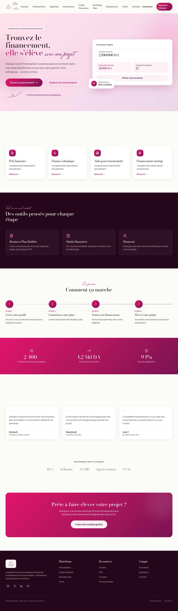

# Ellevadz


## Ellevadz  "Elle s'élève | Women entrepreneurship platform "
Ellevadz is a full SaaS platform designed to empower women entrepreneurs by providing a complete digital ecosystem to develop, manage, and grow their projects. The platform connects entrepreneurs with experts, institutions, learning resources, and a supportive community, making entrepreneurship more accessible and collaborative.
### Main Features:
* **Entrepreneur Space**: Create business plans, access courses and resources, apply for funding, and connect with the community.
* **Expert Space:** Review business plans, provide professional feedback, mentor entrepreneurs, and manage meetings and consultations.
* **Institution Space:** Manage financing programs, review applications, discover promising projects, and support entrepreneurs.
* **Admin Dashboard:** Manage users, content, courses, resources, platform activity, and the overall Ellevadz ecosystem.
* **Community & Communication:** Connect entrepreneurs, experts, and institutions through discussions, messaging, notifications, and collaboration.
* **Learning & Resources:** Access courses, articles, videos, and educational content focused on entrepreneurship and professional development.
* **Business & Funding Management:** Develop business plans, explore financing opportunities, submit applications, and track progress.

## Ellevadz main page 



## how to install 
Follow these steps to install and run Ellevadz locally.

### 1. **Clone the repository**
```bash
git clone https://github.com/sebiakods/Elleva.git
cd Elleva
```
### 2. Install Dependencies
Install the dependencies for both the frontend and backend:
#### Frontend

```bash
cd frontend
npm install
```

#### Backend

```bash
cd ../backend
npm install
```

### 3. Configure environment variables
Create the required environment files and configure your database, authentication, storage, and API settings:
Create the required environment files and configure your database, authentication, storage, and API settings:

```text
# Frontend
frontend/.env.local

# Backend
backend/.env
```

Example frontend configuration:

```env
NEXT_PUBLIC_API_URL=/api
```

### 4. Set Up the Database

Make sure your **PostgreSQL** database is configured, then run:

```bash
cd backend
npx prisma generate
npx prisma migrate dev
```

Optionally, seed the database:

```bash
npx tsx prisma/seed.ts
```
### 5. Run the Application

Start the backend:

```bash
cd backend
npm run dev
```

Then, open a **separate terminal** and start the frontend:

```bash
cd frontend
npm run dev
```
### 6. Open Ellevadz
Once both servers are running, open:
```bash
http://localhost:3000
```

## how to tweak this project for ur own use
You can easily adapt Ellevadz to fit your own needs. Start by updating the environment variables for your database, API, authentication, and storage settings. You can then customize the branding, colors, pages, user roles, and platform features directly in the frontend and backend. If you want to add new functionality, update the corresponding Prisma models, API routes, and frontend components.

## find a bug ?
If you find a bug, feel free to open an issue and describe what happened, including the steps to reproduce it.

